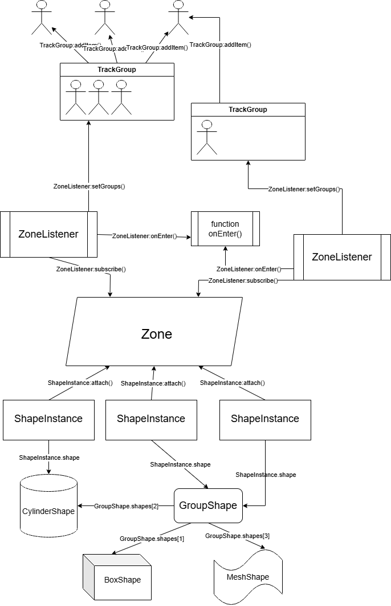

# Introduction
---

SimplerZone is the successor to LessSimpleZone & SimpleZone, a versatile & flexible spatial zone module for tracking where and when specific items enter specific areas of your game, doing spatial checks, etc.

To use the module, download the .rbxm binary from the releases of the GitHub.

The general hierarchy of objects inside the SimplerZone library:
